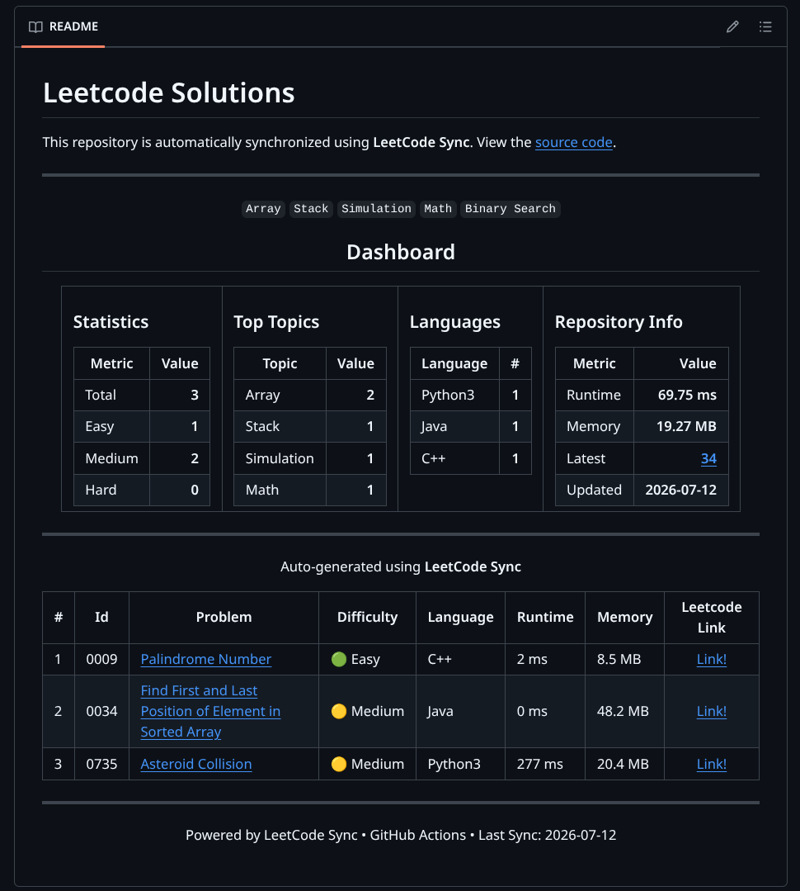
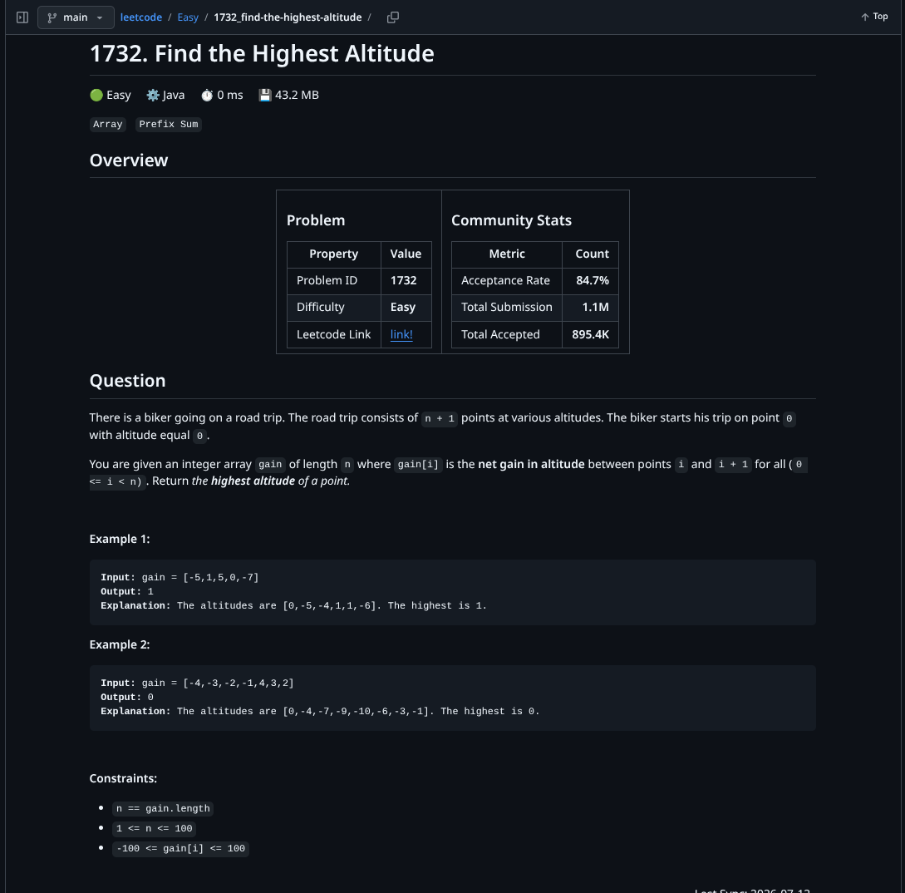
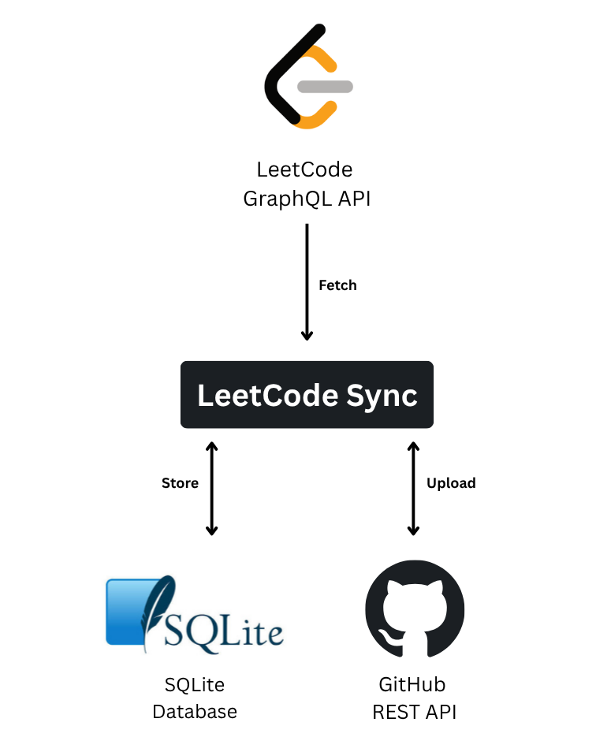
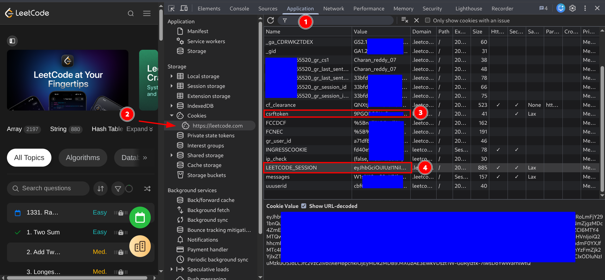
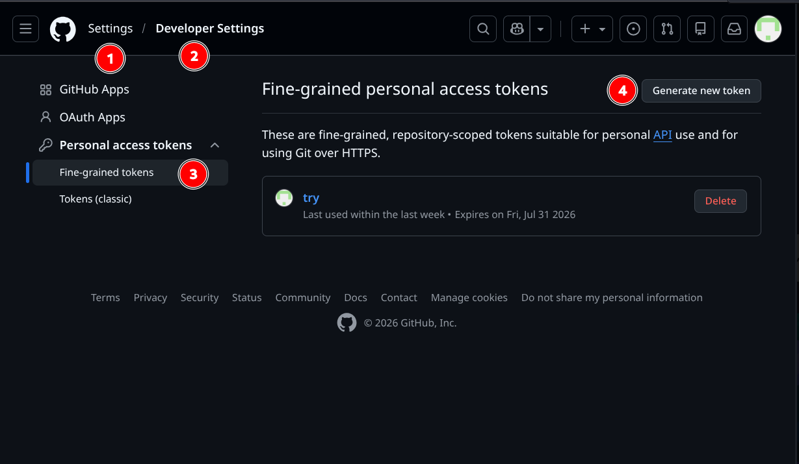
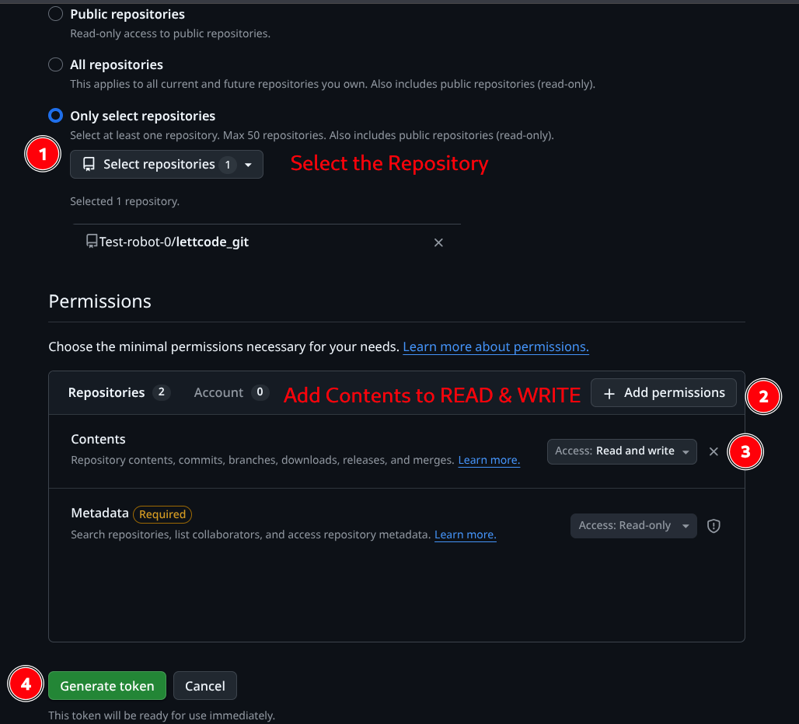

#  LeetCode Sync


Solving LeetCode problems was easy, but maintaining a GitHub repository wasn't. Every accepted problem required manually copying the solution, creating the folder structure, updating README files, committing the changes, and pushing them to GitHub.

To eliminate that repetitive workflow, I built LeetCode Sync—an automation tool that incrementally synchronizes accepted LeetCode solutions to GitHub while tracking progress in SQLite and recovering automatically from interruptions.


LeetCode Sync automatically detects new accepted LeetCode submissions, generates documentation, and synchronizes them to GitHub while maintaining synchronization state in SQLite.

## Contents

- Features
- Generated Output
- System Architecture
- Synchronization Pipeline (Detailed)
- Synchronization State Machine
- GitHub Actions
- Tech Stack
- Installation
- Configuration
- Usage

##  Features

- Incremental synchronization
- GraphQL integration
- GitHub REST API integration
- SQLite state management
- Automatic README generation
- Resume after interruption
- Retry failed operations
- GitHub Actions automation
- Automatic folder generation
- SHA tracking for updates

## Generated Output
### Root README Example

  
### Problem README Example


## System Architecture



## Synchronization Pipeline (Detailed)
```
                           Fetch Solved Problems
                                    │
                                    ▼
                              frontend_id
                              title_slug
                              difficulty
                              topic_tags
                                    │
                                    ▼
                           SQLite (status = 1)
                                    │
                                    ▼
                        Fetch Submission Details
                                    │
                                    ▼
                              submission_id
                              runtime
                              memory
                              language
                                    │
                                    ▼
                           SQLite (status = 2)
                                    │
                                    ▼
                           Fetch Source Code
                                    │
                                    ▼
                              submitted_code
                                    │
                                    ▼
                           SQLite (status = 3)
                                    │
                                    ▼
                           Fetch Question Data
                                    │
                                    ▼
                              description
                              examples
                              constraints
                              stats
                                    │
                                    ▼
                           SQLite (status = 4)
                                    │
                                    ▼
                           Generate problem README
                                    │
                                    ▼
                              Upload to GitHub
                                    │
                                    ▼
                           SQLite (status = 5)
                                    │
                                    ▼ 
                              Getting Solutions 
                                    │
                                    ▼
                              Uplod to GitHub
                                    │
                                    ▼
                           SQLite (status = 6)
                                    │
                                    ▼ 
                           Generate root README 
                                    │
                                    ▼
                           Uploading to GitHub
                                    │
                                    ▼
                           SQLite (status = 7)
                                    │
                                    ▼ 
                              GitHub REST API
                                    │
                                    ▼
                              Repository
```

## Synchronization State Machine

```
Status 0 (Start)
   │ 
   ▼ 
Status 1 (Done Problem Info)
   │ 
   ▼ 
Status 2 (Problem Submission Info)
   │ 
   ▼ 
Status 3 (Solved Code)
   │ 
   ▼ 
Status 4 (Problem Question)
   │ 
   ▼ 
Status 5 (GitHub Upload Problem README)
   │ 
   ▼ 
Status 6 (GitHub Upload Problem Solution)
   │ 
   ▼ 
Status 7 (GitHub Upload Root README)
```

### Retry & Recovery
```
                                    SQL 
               (Gets the id which status < 7 AND retry_count < 3)
                                     │ 
                                     ▼ 
                                    Try
                                     │ 
                                     ▼   
                           ───────────────────  
                           │                 │                
                         Failed           Success
                           │                 │ 
                           ▼                 ▼ 
                       Exception          execute
                           │
                           ▼
                     retry_count++
                           │
                           ▼
                     Error Message
                           │
                           ▼
                        SQLITE
```

## GitHub Actions
```
                     GitHub Actions (Cron)
                             │
                             ▼
                     Run main.py
                             │
                             ▼
                     Fetch next pending problem
                     (status < 7 AND retry_count < 3)
                             │
                             ▼
                     Synchronize ONE problem
                             │
                             ├── Success
                             │      │
                             │      ▼
                             │  Update Status
                             │
                             └── Failure
                                    │
                                    ▼
                             Increment Retry
                                    │
                                    ▼
                             Exit Workflow
```

### GitHub Actions
Every scheduled GitHub Actions run processes exactly one pending problem, updates its synchronization state, and exits. If a failure occurs, the next scheduled run resumes from the last successful stage without repeating completed work.

## Design Choice

LeetCode Sync intentionally synchronizes one pending problem during each scheduled execution.

Benefits:

• Faster execution
• Lower API usage
• Easier recovery
• Reliable GitHub Actions
• No duplicate uploads


## Tech Stack

- python
- sqlite3
- LeetCode GraphQL API
- GitHub REST API
- Markdown
- GitHub Actions


## Project Structure
```

Leetcode Sync/
├── .env                    # Environment variables
├── config.py               # Configuration
├── main.py                 # Entry point
├── requirements.txt        # Dependencies            
├── README.md               # Documentation
├── utils.py                # Utilities
│
├─── database/              
│   ├── connection.py       # Database connection
│   ├── database.db         # SQLite database
│   ├── repository.py       # Database queries  
│   └── schema.py           # Database schema
│
├── github/                 
│   ├── api.py              # GitHub REST API
│   └── readme.py           # README generator
│
└── leetcode/               
    ├── api.py              # LeetCode GraphQL API
    ├── queries.py          # GraphQL queries
    └── questions.py        # Problem handlers
 
```

## Installation
``` bash 
git clone https://github.com/Charanreddy0007/leetcode-sync.git
cd leetcode-sync
pip install -r requirements.txt
```

## Configuration
``` bash
TOKEN=your_github_token
LEETCODE_SESSION=your_session_cookie
CSRFTOKEN=your_csrf_token
```
| Variable         | Description                                |
| ---------------- | ------------------------------------------ |
| TOKEN            | GitHub Personal Access Token               |
| LEETCODE_SESSION | Your authenticated LeetCode session cookie |
| CSRFTOKEN        | LeetCode CSRF token                        |

### 1. Obtaining LeetCode Cookies

1. Log in to LeetCode.
2. Open Developer Tools (F12).
3. Navigate to the **Application** (or **Storage**) tab.
4. Open **Cookies** → `https://leetcode.com`.
5. Copy:

- `LEETCODE_SESSION`
- `csrftoken`



> [!WARNING]
> Never share or commit your `LEETCODE_SESSION` or `csrftoken`.
> Store them in your local `.env` file or GitHub Actions Secrets.

LeetCode uses authenticated GraphQL endpoints for accessing your solved problems and submissions. Therefore, LeetCode Sync requires your authenticated browser cookies (`LEETCODE_SESSION` and `csrftoken`).

### 2.1 Create a GitHub Personal Access Token

1. Open **GitHub → Settings**.
2. Navigate to **Developer Settings**.
3. Select **Fine-grained personal access tokens**.
4. Click **Generate new token**.
5. Configure the required repository permissions.



### 2.2 Configure Repository Permissions

1. Select **Only select repositories**.
2. Choose the repository where solutions will be synchronized.
3. Add the **Contents** permission.
4. Set **Contents** to **Read & Write**.
5. Click **Generate token**.



> [!NOTE]
> The token requires **Contents → Read and Write** permission for the target repository.

> [!WARNING]
> GitHub only displays the token once. Copy it immediately and store it securely. Never commit it to your repository.

### 3 Configure .env
```
TOKEN=ghp_xxxxxxxxxxxxxxxxxxxxx
LEETCODE_SESSION=xxxxxxxxxxxxxxxx
CSRFTOKEN=xxxxxxxxxxxxxxxx
```

## Usage
``` bash
python main.py
```

## License

MIT License

## Contributing

Contributions are welcome!

If you'd like to improve LeetCode Sync, feel free to open an issue or submit a pull request.


## Conclusion

The project demonstrates how GraphQL, SQLite, GitHub REST APIs, and GitHub Actions can be combined to build a reliable, resumable synchronization system for automatically maintaining a LeetCode repository.